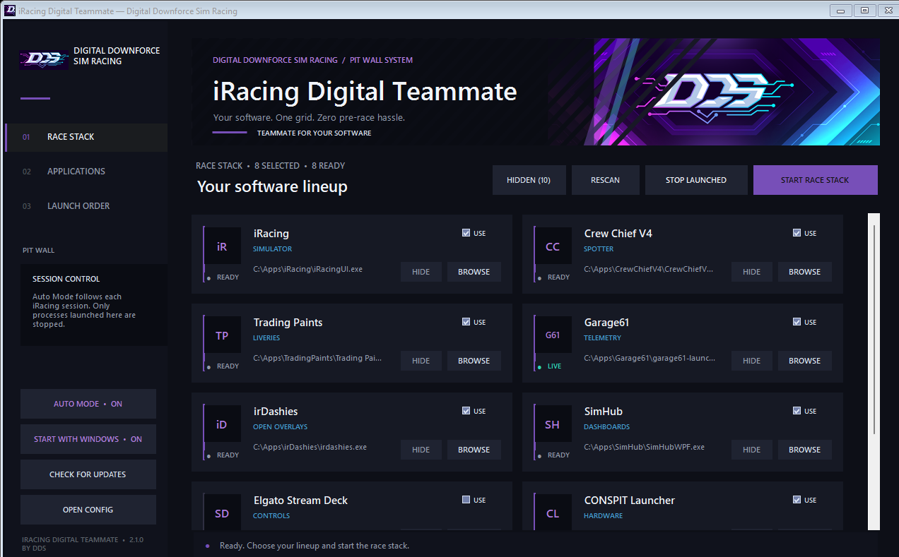

# iRacing Digital Teammate

**Teammate for your software — by Digital Downforce Sim Racing.**

A lightweight Windows pit-wall launcher that starts an iRacing software stack in a
predictable order and keeps the pre-race routine in one place.



## Download

Download the Windows installer from the repository's
[latest GitHub Release](../../releases/latest). Run
`iRacing-Digital-Teammate-Setup-vX.Y.Z.exe`; it installs for the current user
without administrator rights, adds the app to Start and Installed apps, and
provides a standard uninstaller. A portable ZIP is also available.

Windows SmartScreen may warn about unsigned community builds. Verify that the file
came from this repository's Releases page before running it.

## Features

- Subtle graphite Digital Downforce Sim Racing interface with embedded DDS logo and banner artwork.
- Automatic detection of iRacing and common companion applications.
- Sequential launch with an individual delay for every application.
- Live running-state indicators and configurable executable paths.
- Safe **Stop launched** action limited to process trees started by Teammate.
- Hide/show application cards without deleting their configuration.
- Optional **Start with Windows** toggle using the current user's standard Startup folder.
- Notification-area operation: Windows startup, the minimize button, and the window
  close button keep Teammate available beside the clock without occupying the taskbar.
- **Auto Mode** starts selected companion apps when an iRacing simulator session
  begins and stops only Teammate-launched apps after the session ends.
- A silent update check runs after startup and while Teammate remains active, at most
  once every 24 hours, and announces new versions in the notification area. Downloads
  and installation still require confirmation and use SHA-256 verification before an
  in-place update and restart.
- Persistent settings under `%APPDATA%\DDS\iRacing Digital Teammate`, with automatic
  migration from earlier branded releases.

## Supported software

iRacing, Crew Chief V4, Trading Paints, Garage61, irDashies, Edge Overlays,
GO Fast (GO Setups), SimHub, iOverlay, Racelab, Elgato Stream Deck, CONSPIT
Launcher, SimConnect Manager, iRSidekick, VRS Telemetry Logger, Kapps, Joel Real Timing,
OpenKneeboard, and Marvin's AIRA.

Applications that are not detected automatically can be configured with **Browse**.

CONSPIT Link 2.0 requires administrator rights. On its first Teammate-managed start,
Windows asks once for permission to create a restricted Task Scheduler bridge. Later
iRacing sessions can start and stop CONSPIT without repeated UAC prompts. The bridge
accepts only `ConspitLink2.0.exe` installed under Program Files.

## Usage

1. Select **Rescan** after the first launch.
2. Use **Browse** for applications that were not detected.
3. Enable the applications that belong in the race stack with **Use**.
4. Select **Start race stack**.
5. Use **Stop launched** only when you intentionally want to close processes that
   were started by Teammate.

With **Auto Mode** enabled, Teammate starts with Windows and waits in the background
for `iRacingSim*`. Starting the iRacing UI alone does not trigger companion apps;
they start when the simulator session process appears. A three-second confirmation
window prevents a brief process transition from triggering premature cleanup.

Closing Teammate itself does not close racing software.
Use **Exit** from the notification-area icon menu when you want to stop Teammate
completely. Double-click the icon to restore the main window.

## Building from source

Requirements:

- Windows 10 or Windows 11
- .NET Framework C# compiler at
  `C:\Windows\Microsoft.NET\Framework64\v4.0.30319\csc.exe`
- Windows PowerShell

Build locally:

```powershell
.\build.ps1
```

To embed a GitHub update source in a local build:

```powershell
.\build.ps1 -UpdateRepository "owner/iRacing-Digital-Teammate"
```

The executable is written to `dist\iRacing Digital Teammate.exe`. Install Inno
Setup 6 and run `build-installer.ps1` to create the Windows installer. `version.txt`
is the single source of truth for the application version.

## Publishing a release

1. Update `version.txt` and `CHANGELOG.md`.
2. Commit the change.
3. Create and push a matching tag, for example `v1.2.0`.
4. GitHub Actions builds the executable and installer, creates a portable ZIP,
   generates SHA-256 checksums, and publishes a GitHub Release.

The release build automatically embeds the repository identity supplied by GitHub,
so **Check for updates** points to the correct Releases feed without manual source edits.

## Project policy

See [CONTRIBUTING.md](CONTRIBUTING.md) before proposing changes and
[SECURITY.md](SECURITY.md) for responsible vulnerability reporting.

## License and trademarks

Copyright © 2026 Digital Downforce Sim Racing. All rights reserved. See [LICENSE](LICENSE).
The supplied DDS artwork is documented in [docs/BRAND_ASSETS.md](docs/BRAND_ASSETS.md).

iRacing and the names of third-party companion applications are trademarks of their
respective owners. This independent project is not affiliated with or endorsed by
iRacing.com Motorsport Simulations or the listed third-party application vendors.
